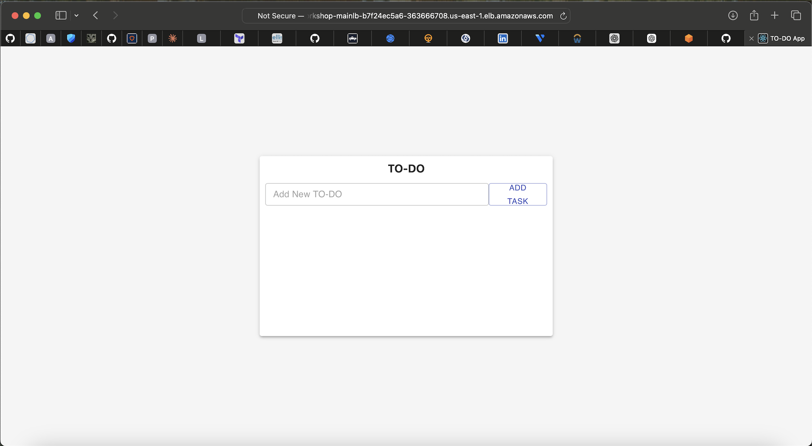
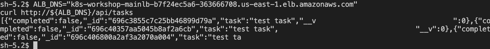
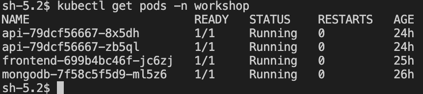
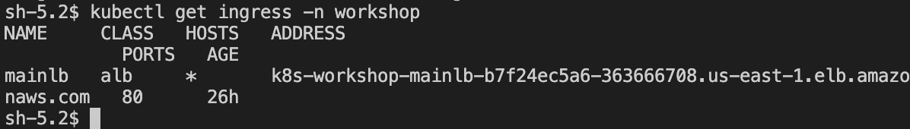

# three-tier-eks-iac

# Architecture
```mermaid
flowchart LR
  User[User/Browser] --> ALB[ALB Ingress]
  ALB --> FE[Frontend Pod]
  ALB -->|/api| BE[Backend Pod]
  BE --> DB[MongoDB Pod]
  Bastion[Bastion (SSM)] --> EKS[EKS Cluster]
```

# Screenshots





# Prerequisites

**Install Kubectl**
https://kubernetes.io/docs/tasks/tools/


**Install Helm**
https://helm.sh/docs/intro/install/

```
helm repo update
```

**Install/update latest AWS CLI:** (make sure install v2 only)
https://aws.amazon.com/cli/

#update the Kubernetes context
aws eks update-kubeconfig --name my-eks-cluster --region us-east-1

# verify access:
```
kubectl auth can-i "*" "*"
kubectl get nodes
```

# Verify autoscaler running:
```
kubectl get pods -n kube-system -l app.kubernetes.io/instance=cluster-autoscaler
```

# Check Autoscaler logs
```
kubectl logs -n kube-system deployment/cluster-autoscaler-aws-cluster-autoscaler -f
```

# Check load balancer logs
```
kubectl logs -n kube-system deployment/aws-load-balancer-controller -f
```

<!-- aws eks update-kubeconfig \
  --name my-eks \
  --region us-west-2 \
  --profile eks-admin -->


# Build Docker images :
**For Mac:**

```
export DOCKER_CLI_EXPERIMENTAL=enabled
aws ecr-public get-login-password --region us-east-1 | docker login --username AWS --password-stdin public.ecr.aws
```

Build Front End :

```
docker buildx build --platform linux/amd64 -t workshop-frontend:v1 app/frontend
docker tag workshop-frontend:v1 public.ecr.aws/<YOUR_ALIAS>/workshop-frontend:v1
docker push public.ecr.aws/<YOUR_ALIAS>/workshop-frontend:v1
```


Build Back End :

```
docker buildx build --platform linux/amd64 -t workshop-backend:v1 app/backend
docker tag workshop-backend:v1 public.ecr.aws/<YOUR_ALIAS>/workshop-backend:v1
docker push public.ecr.aws/<YOUR_ALIAS>/workshop-backend:v1
```

**For Linux/Windows:**

Build Front End :

```
docker build -t workshop-frontend:v1 app/frontend
docker tag workshop-frontend:v1 public.ecr.aws/<YOUR_ALIAS>/workshop-frontend:v1
docker push public.ecr.aws/<YOUR_ALIAS>/workshop-frontend:v1
```


Build Back End :

```
docker build -t workshop-backend:v1 app/backend
docker tag workshop-backend:v1 public.ecr.aws/<YOUR_ALIAS>/workshop-backend:v1
docker push public.ecr.aws/<YOUR_ALIAS>/workshop-backend:v1
```


**Create Namespace**
```
kubectl create ns workshop

kubectl config set-context --current --namespace workshop
```

# MongoDB Database Setup

**To create MongoDB Resources**
```
kubectl apply -f k8s_manifests/mongo/secrets.yaml
kubectl apply -f k8s_manifests/mongo/deploy.yaml
kubectl apply -f k8s_manifests/mongo/service.yaml
```

# Backend API Setup

Create NodeJs API deployment by running the following command:
```
kubectl apply -f k8s_manifests/backend-deployment.yaml
kubectl apply -f k8s_manifests/backend-service.yaml
```


**Frontend setup**

Create the Frontend  resource. In the terminal run the following command:
```
kubectl apply -f k8s_manifests/frontend-deployment.yaml
kubectl apply -f k8s_manifests/frontend-service.yaml
```

Finally create the final load balancer to allow internet traffic:
```
kubectl apply -f k8s_manifests/full_stack_lb.yaml
```

# Verification
After everything is applied, confirm the pods are running and the ALB is provisioned:
```
kubectl get pods -n workshop
kubectl get ingress -n workshop
```

If the ingress `ADDRESS` is set, grab the ALB DNS and test the app. The backend expects a `task` field:
```
ALB_DNS=$(kubectl get ingress -n workshop mainlb -o jsonpath='{.status.loadBalancer.ingress[0].hostname}')

curl -H "Host: app.sandipdas.in" http://${ALB_DNS}
curl -H "Host: app.sandipdas.in" http://${ALB_DNS}/api/tasks
curl -H "Host: app.sandipdas.in" -H "Content-Type: application/json" -X POST -d '{"task":"test task"}' http://${ALB_DNS}/api/tasks
```

Note: If you change the ingress host, update the `Host` header to match it.


# Any issue with the pods ? check logs:
kubectl logs -f POD_ID -f


# Grafana setup 
Username: admin
Password: prom-operator

Import Dashboard ID: 1860

Exlore more at: https://grafana.com/grafana/dashboards/
